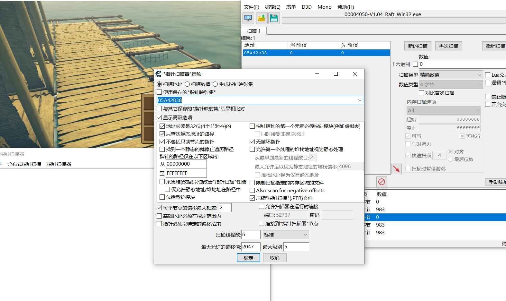
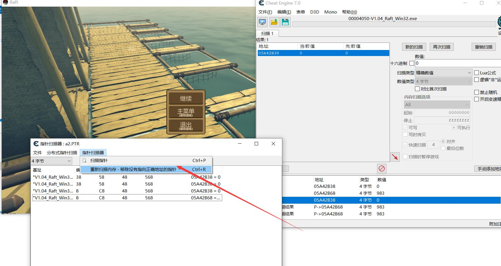
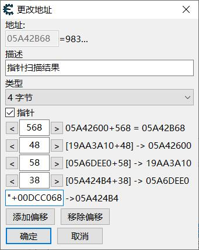

# 基址 & 指针




```
struct a {}

a* InitA() {
    // 在这里初始化
    return new a{};
}

strcut b {
    a* c;
}

strcut c {
    b* b;
}


int main() {
    
    return 0;
}
```
// 额 算了 我不代码描述了  就是很多层包装这个指针

// 我们要找到他的第一级指针

### 步骤:
1. 先用找到这个指针当前的地址
2. 枚举对当前指针的所有调用地址 (可能很对都是动态的)
3. 重启程序 
4. 执行步骤1 步骤2  比对现在剩下的数字

就是穷举法 淦


当前程序这个就是4级指针
