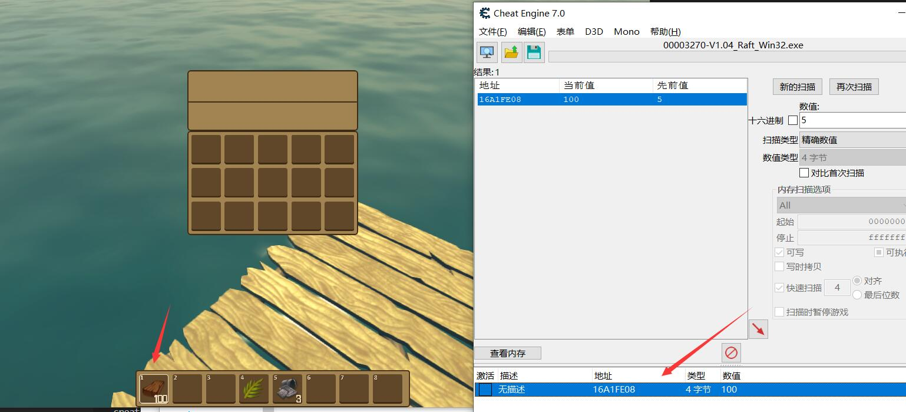
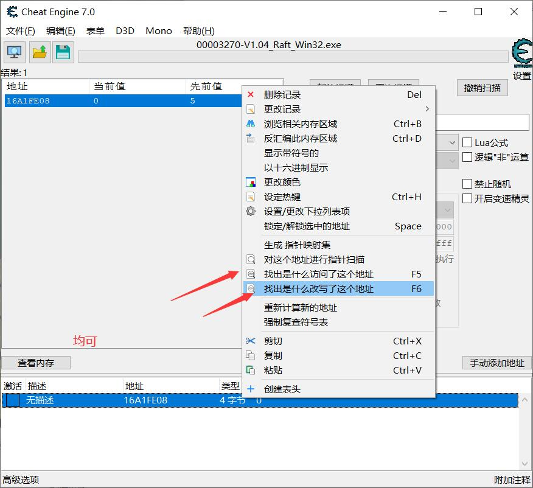
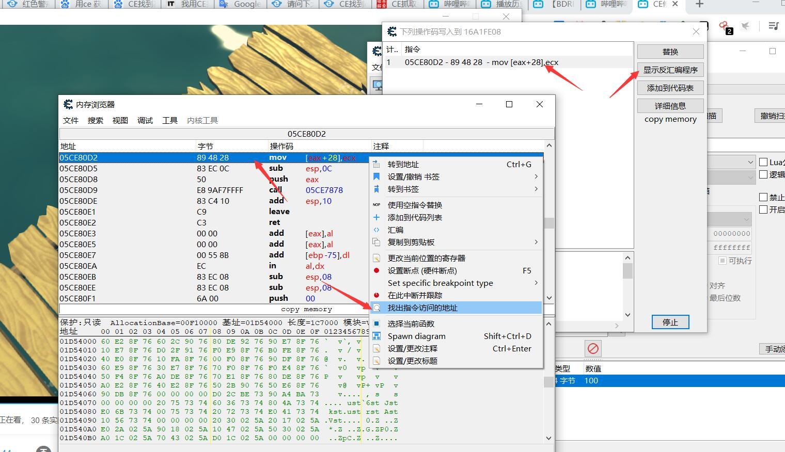
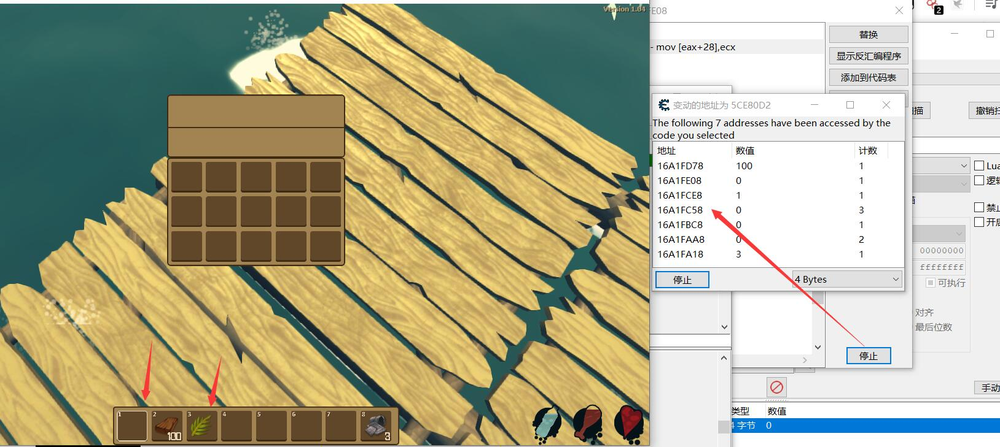

# 通过公用方法快速获取地址
### 基础原理
```
void ModifyHP(User* u,int number) {
    u.midifyHp(number)
}
```
上面写了一个非常简单修改血量的函数
参数  什么人  修改值为多少  
就可以通过这个方法访问了那些地址 从而得到我们需要的地址

### 步骤
1. 找到一个被操作地址


2. 找到什么函数访问或者改写了这个值

3. 找到这个函数访问了什么内存地址

4. 哈哈就over了
