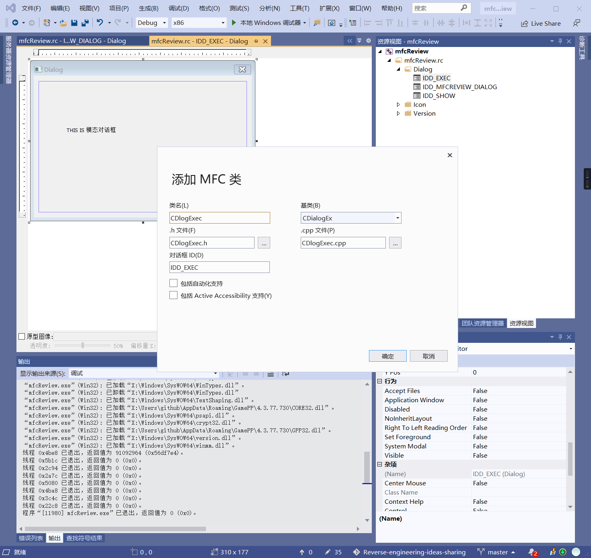
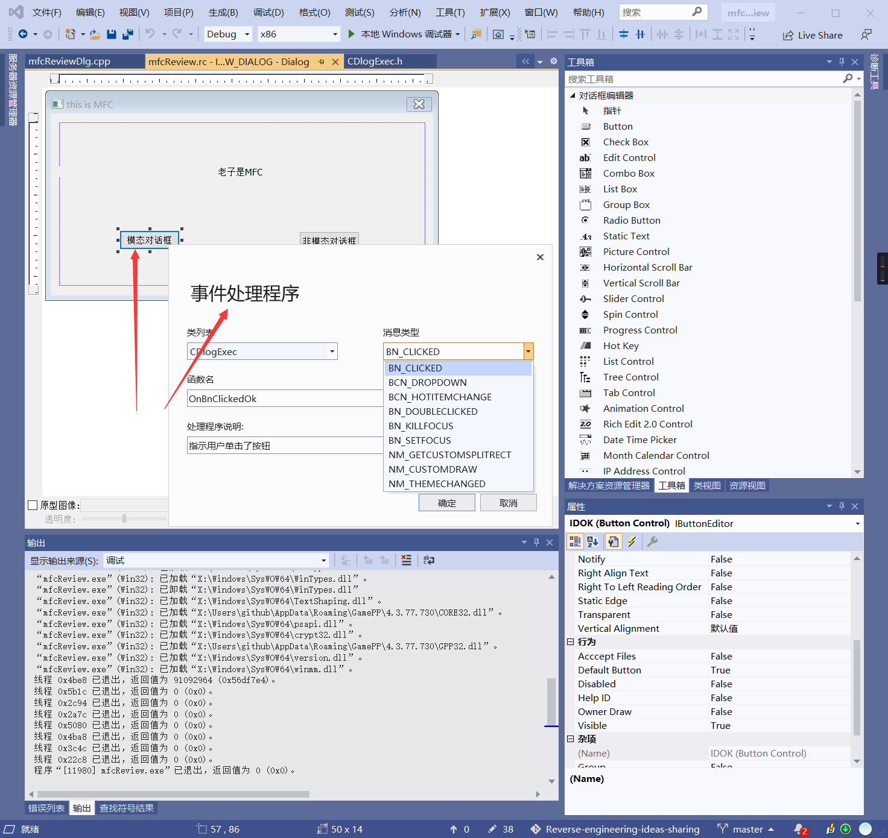
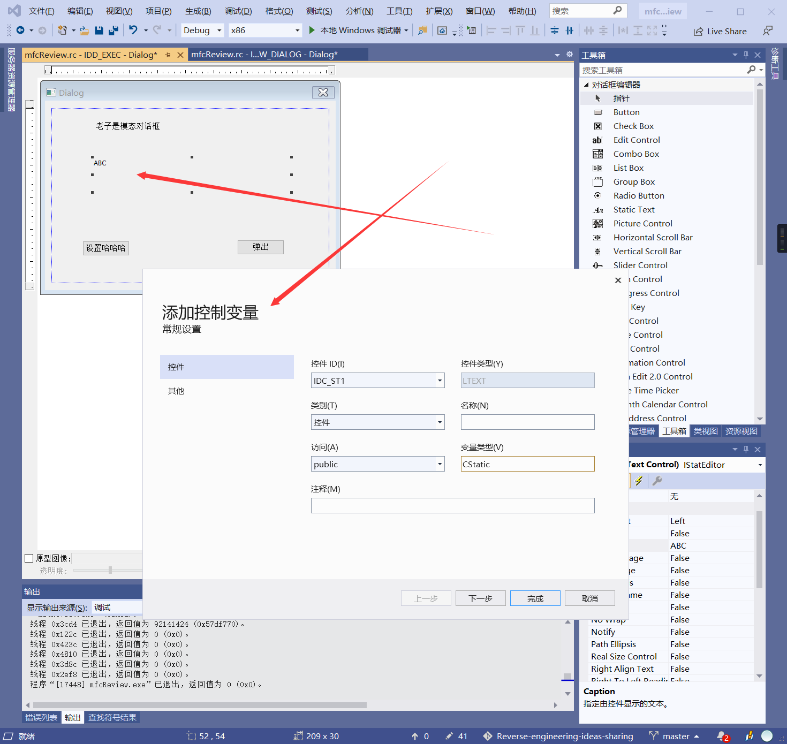
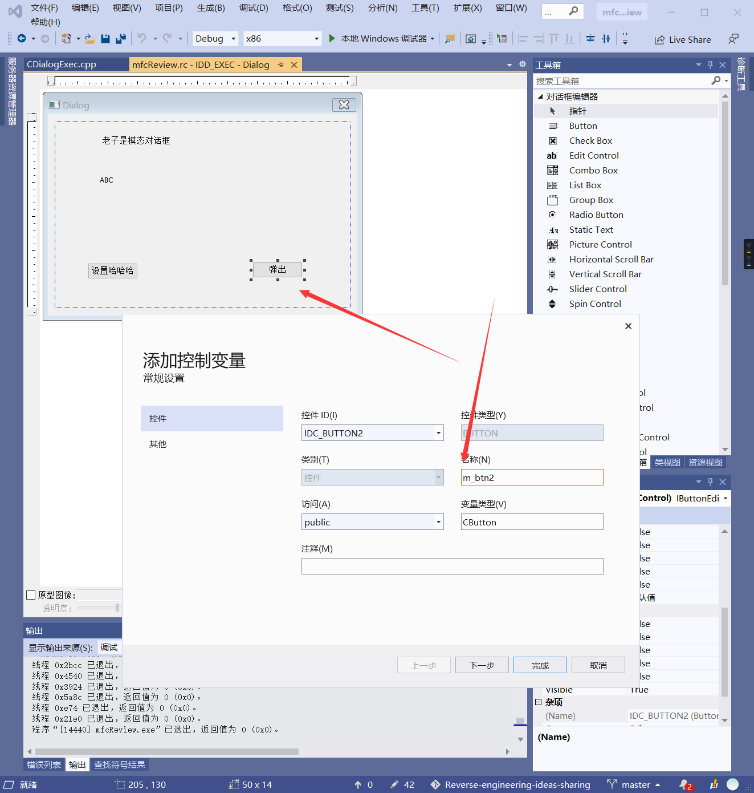
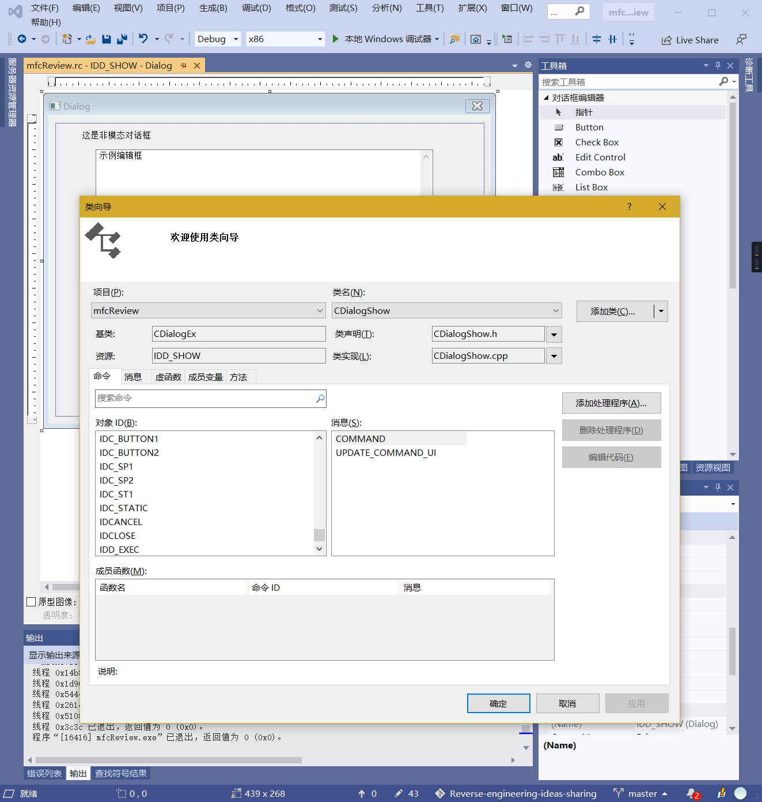
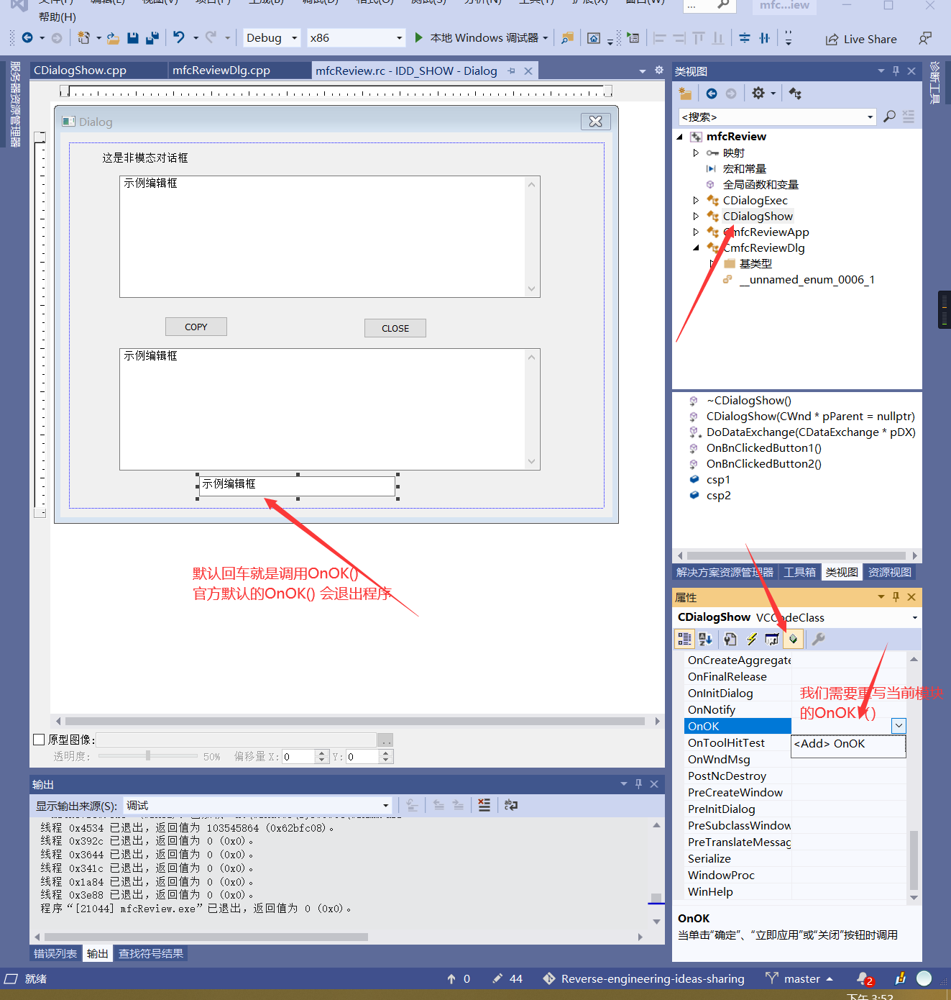
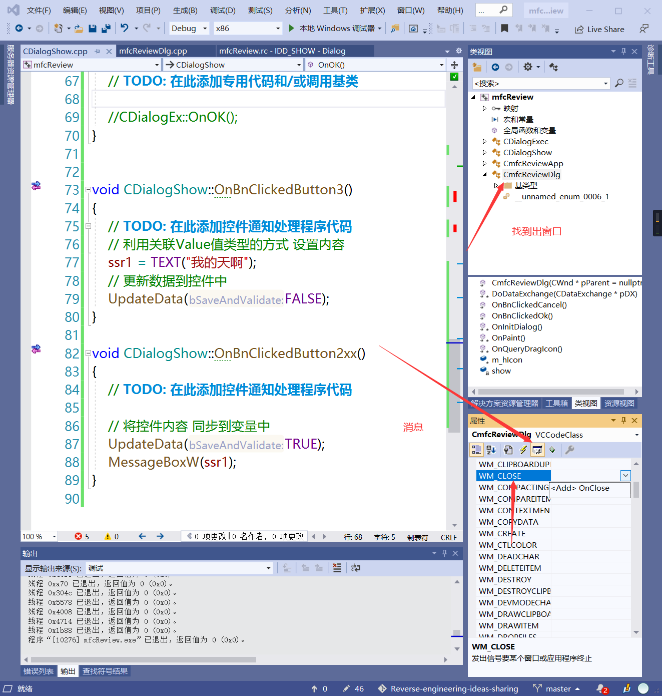
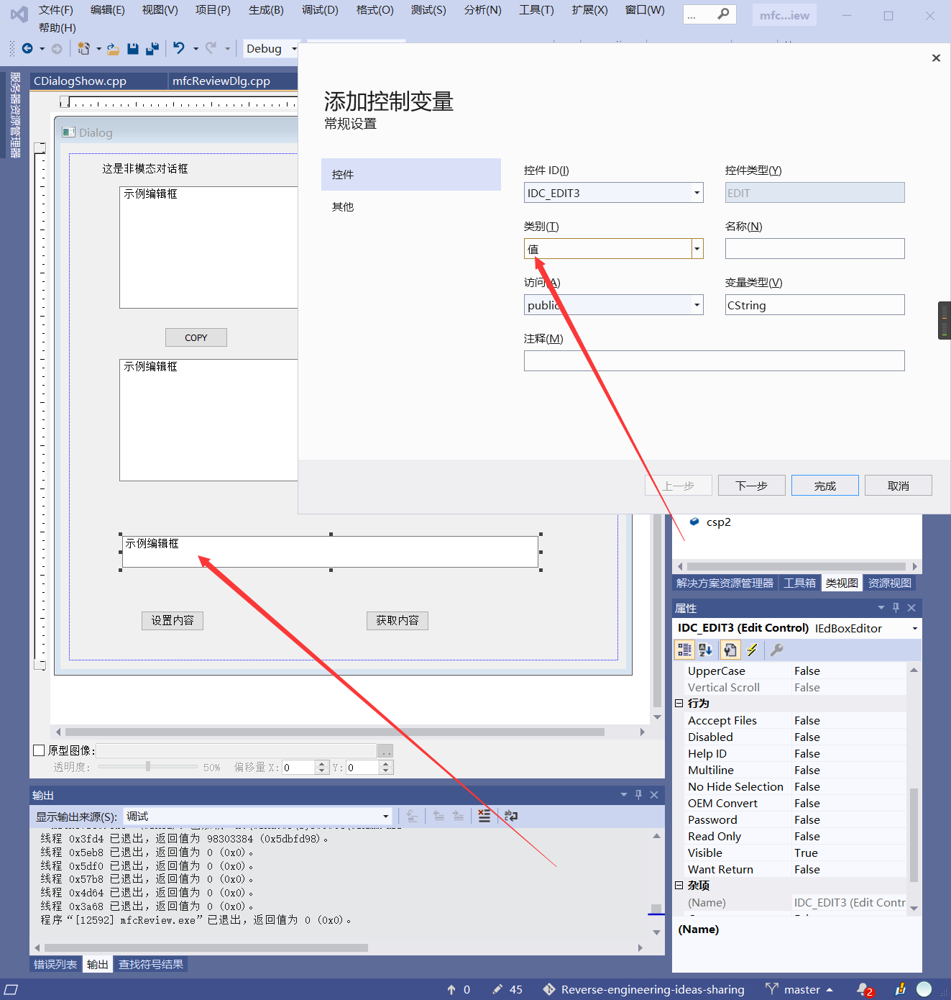

# 复习MFC

### 基于对话框

创建一个新的对话框   右键添加Class与之绑定

对一个对象 右键 添加事件处理程序 (如果双击 会直接添加 单击事件)

#### 模态对话框
```cpp

#include "CDlogExec.h" // 导入 目标Dialog class 地址
void CDlogExec::OnBnClickedOk()
{
	// TODO: 在此添加控件通知处理程序代码

	// 弹出模态对话框
	CDialogEx dlg;   // 声明diallog class
	dlg.DoModal(); // 以模态形式弹出
	
}
```
#### 非模态对话框
1. 全局声明
mfcReviewDlg.h
```cpp
class CmfcReviewDlg : public CDialogEx

private:
	CDialogShow show;  // 加上全局声明
};
```
2. 全局初始化
mfcReviewDlg.cpp
```cpp
// 找到 OnInitDialgo() 方法

BOOL CmfcReviewDlg::OnInitDialog()
{
	CDialogEx::OnInitDialog();
	show.Create(IDD_SHOW);
```
3. 添加事件
```cpp
void CmfcReviewDlg::OnBnClickedCancel()
{
	// TODO: 在此添加控件通知处理程序代码
	//CDialogEx::OnCancel();


	// 创建对话框
	// show.Create(IDD_SHOW);  // 对话框ID
	// 显示
	show.ShowWindow(SW_SHOWNORMAL);
}
```

#### 元素绑定

`DoDataExchange()` 会进行关联
设置内容
```CPP
void CDialogExec::OnBnClickedButton1()
{
	// TODO: 在此添加控件通知处理程序代码
	sb1.SetWindowTextW(TEXT("呵呵呵"));
}
```
获取内容
```cpp
void CDialogExec::OnBnClickedButton2()
{
	// TODO: 在此添加控件通知处理程序代码
	CString str;
	sb1.GetWindowTextW(str);
	MessageBox(str);
}
```
控件更多的操作

```cpp
void CDialogExec::OnBnClickedButton2()
{
	// TODO: 在此添加控件通知处理程序代码
	CString str;
	sb1.GetWindowTextW(str);
	MessageBox(str);

	m_btn2.SetWindowTextW(TEXT("已经弹出了"));
	m_btn2.EnableWindow(FALSE); // 设置禁用
}

```

右键类向导看到所有成员信息
```cpp
void CDialogShow::OnBnClickedButton1()
{
	// TODO: 在此添加控件通知处理程序代码
	CString str1;
	csp1.GetWindowTextW(str1);
	csp2.SetWindowTextW(str1);
}


void CDialogShow::OnBnClickedButton2()
{
	// TODO: 在此添加控件通知处理程序代码

	// exit(0); // 退出整个程序

	CDialogShow::OnOK();  // 退出当前程序
	// CDialogShow::OnCancel();
}
```


### 修复默认BUG
1. 编辑框 回车自动推出


```cpp
void CDialogShow::OnOK()
{
	// TODO: 在此添加专用代码和/或调用基类

	//CDialogEx::OnOK(); 注释掉就行了
}
```
2. 关闭X的时候 会弹出 窗口
关闭时 回向系统发出`WM_CLOSE` 消息


```cpp
void CmfcReviewDlg::OnClose()
{
	// TODO: 在此添加消息处理程序代码和/或调用默认值

	// CDialogEx::OnClose();
	exit(0);
}
```
#### 编辑框以值的形式

```cpp
void CDialogShow::OnBnClickedButton3()
{
	// TODO: 在此添加控件通知处理程序代码
	// 利用关联Value值类型的方式 设置内容
	ssr1 = TEXT("我的天啊");
	// 更新数据到控件中
	UpdateData(FALSE);
}

void CDialogShow::OnBnClickedButton2xx()
{
	// TODO: 在此添加控件通知处理程序代码

	// 将控件内容 同步到变量中
	UpdateData(TRUE);
	MessageBoxW(ssr1);
}
```


### 关于MDF DLL
需要在初始化阶段显示
```cpp
// Chook1App 初始化

BOOL Chook1App::InitInstance()
{
	CWinApp::InitInstance();

	// 显示Dialog
	index dig;
	dig.DoModal();
	// OR    =>    // CDialog dlg(dlg_id);    dlg.DoModal()

	
	return TRUE;
}

```
调试DLL
```
rundll32 DLLName.dll,DllMain
```