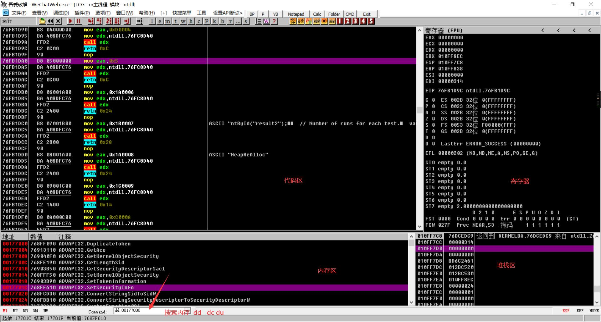
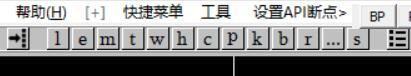
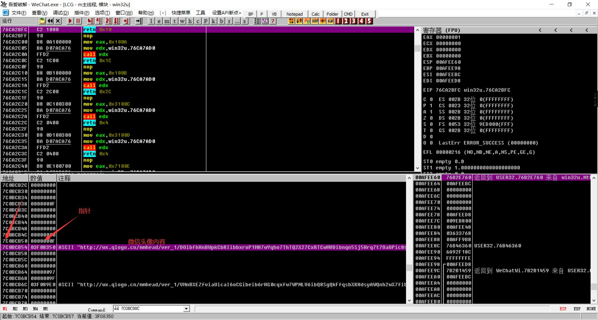
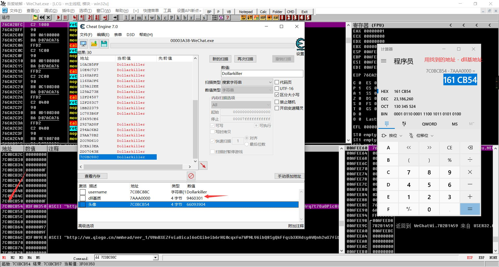
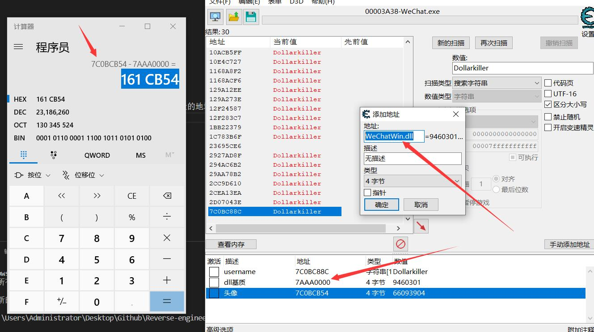
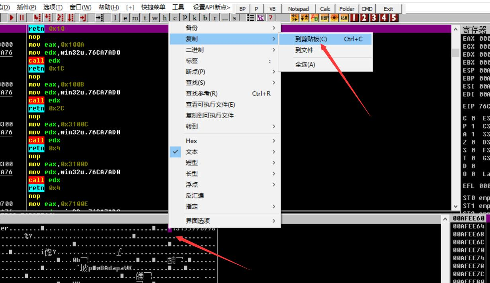
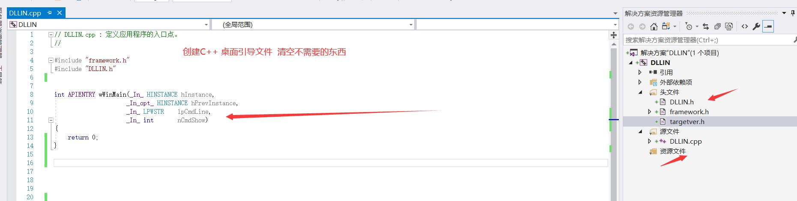
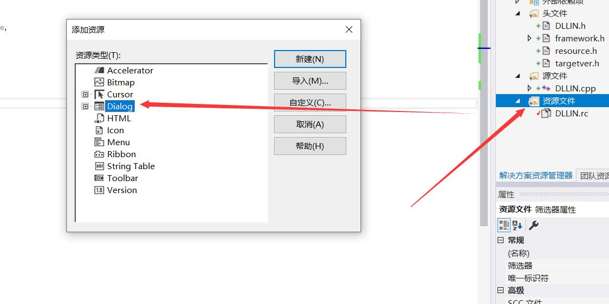
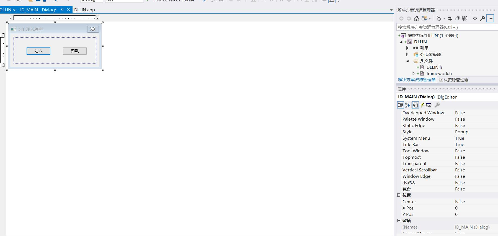
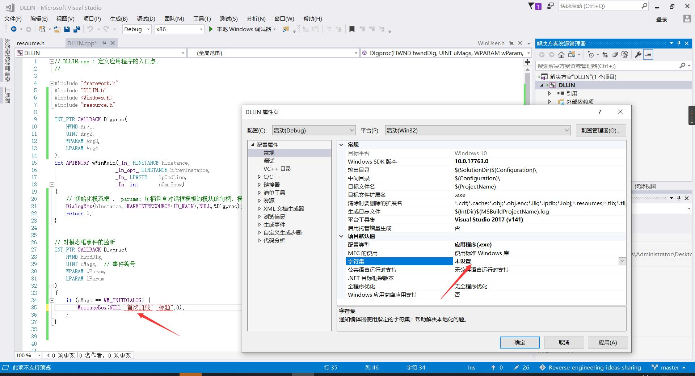

# WeChat 逆向

### OD入门
- command search
    - dd  内存地址  普通查询
    - dc   以char字符显示
    - du   以UTF8编码显示
- 上面几个小按钮

    - t 查看线程
    - c 回到主界面
    - b 全部断点
        - 选中空格  停止改断点功能

### 常用快捷键
- F2 设置断点

### 简单查询

先通过ce 查询到结构体中一个数据的基地址 然后

再附近内存地址中查询 其他需要的数据

注: 偏移的计算  找到新的内存地址 - dll基地址的地址

####  如果在相邻的内存中早到位置呢？

更具最前面的位置或者是最后面位置进行推导

### C语言开发DLL注入工具
基础知识
- `CreateToolhelp32Snapshot` 获取进程快照取得进程PID
- `VirtualAllocEx` 申请内存
- `WriteProcessMemory` 用来写入注入DLL路径
- `GetModuleHandle` 获取Kernel32基址
- `GetProcAddress` 获取加载DLL函数的地址
- `CreateRemoteThread` 在别人的进程里面执行加载DLL函数  从而实现加载我们的DLL实现注入

> Kernel32.dll(所有软件都会包含) LoadLibrary

> LoadLibaray 全局地址 0X12345678

如果遇到输出字符串有斜杠 请设置字符集
